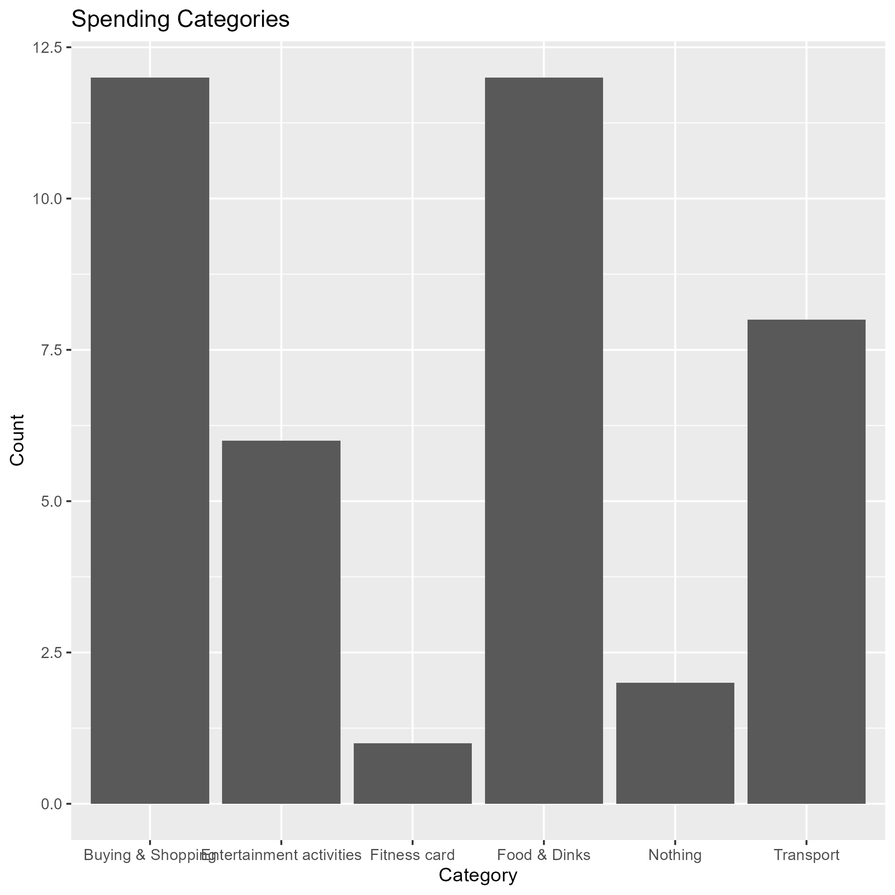
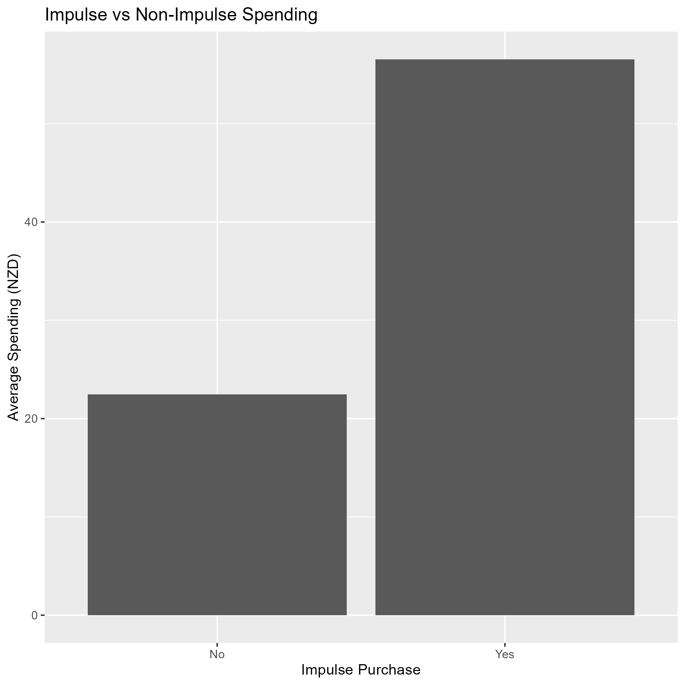
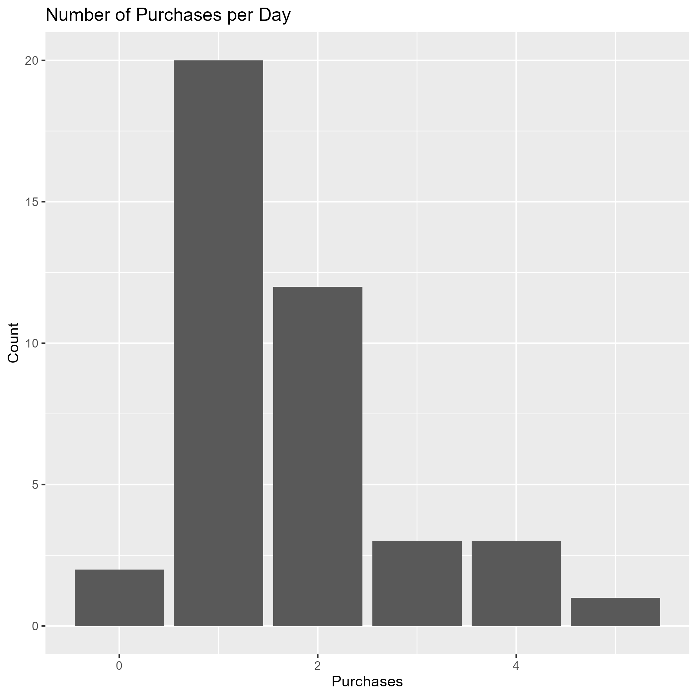

<script src="https://code.jquery.com/jquery-3.7.1.min.js"></script>

```{r setup, include=FALSE}
knitr::opts_chunk$set(echo=FALSE, message=FALSE, warning=FALSE, error=FALSE)
```
```{js}
$(function() {
  $(".level2").css('visibility', 'hidden');
  $(".level2").first().css('visibility', 'visible');

  $(".container-fluid").height($(".container-fluid").height() + 300);

  $(window).on('scroll', function() {
    $('h2').each(function() {
      var h2Top = $(this).offset().top - $(window).scrollTop();
      var windowHeight = $(window).height();

      if (h2Top >= 0 && h2Top <= windowHeight / 2) {
        $(this).parent('div').css('visibility', 'visible');
      } else if (h2Top > windowHeight / 2) {
        $(this).parent('div').css('visibility', 'hidden');
      }
    });
  });
})
```

```{css}
body {
  background-color: #fffaf0;
}
h2 {
  color: #333333;
}
```

## Introduction to Spending Data
This section introduces my everyday spending over a period of time, including categories and amounts.


## Impulse or not impulse Spending
This section compares spending between impulse and non-impulse purchases.


## Number of Purchases
This section shows how many purchases I made each day.



